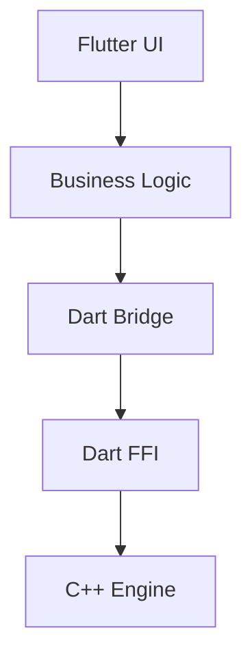

# Compiano Studio

**Compiano Studio** est une application d'apprentissage du piano assistée par IA, construite sur un moteur de rendu musical C++ haute performance intégré dans Flutter.

Ce projet sert d'implémentation de référence pour l'intégration de la bibliothèque `mXMLConverter` via **Dart FFI**, démontrant une architecture "Zero-Copy" pour un rendu graphique fluide (60fps) de partitions complexes.

---

## ✨ Fonctionnalités Clés

### Moteur de Partition (Core)
- **Formats supportés** : MusicXML (`.xml`, `.musicxml`) et MXL compressé.
- **Rendu Haute Fidélité** : Utilisation du standard **SMuFL** (Bravura) pour une gravure musicale professionnelle.
- **Performance** : Moteur C++ natif pour le parsing et le layout, rendu direct sur Canvas Flutter sans intermédiaire SVG.
- **Personnalisation** : Plus de 50 options de gravure (espacements, polices, couleurs, mode sombre).

### Studio d'Apprentissage (En cours)
- **Clavier Virtuel** : Visualisation temps réel des notes.
- **Mode Sombre** : Support natif pour le confort visuel.
- **IA & Analyse** (Roadmap) :
    - Détection automatique de la difficulté.
    - Génération de routines de travail personnalisées.
    - Suivi de progression via écoute active (Pitch Detection).

---

## 🏗 Architecture Technique

L'application suit une **Layered Architecture** stricte pour isoler la complexité de la gestion mémoire native.



- **UI Layer** : Widgets Flutter réactifs (`ScorePainter`, `PianoKeyboard`).
- **Bridge Layer** : `lib/core/bridge.dart` gère le chargement des bibliothèques dynamiques (`.so`, `.dll`, `.dylib`) et le mapping des types C/Dart.
- **Native Layer** : `libmxmlconverter` (C++) effectue le calcul lourd (Layout, Engraving) et renvoie un buffer de commandes de dessin légères.

Voir ARCHITECTURE.md pour les détails complets.

---

## 🚀 Installation & Démarrage

### Pré-requis
- **Flutter SDK** (Stable channel)
- **CMake** & Compilateur C++ (GCC/Clang/MSVC) pour reconstruire la lib native si nécessaire.

### Configuration de la librairie native
Le projet dépend de `libmxmlconverter`. Assurez-vous que le binaire compilé est accessible :

- **Linux** : `libmxmlconverter.so` dans le dossier racine ou `LD_LIBRARY_PATH`.
- **Windows** : `mxmlconverter.dll` à côté de l'exécutable.
- **macOS** : `libmxmlconverter.dylib`.

### Lancer l'application
```bash
# Récupérer les dépendances
flutter pub get

# Lancer en mode debug (Desktop recommandé pour le dev)
flutter run -d linux  # ou windows, macos
```

---

## 📂 Structure du Projet

```text
lib/
├── core/           # Pont FFI et définitions bas niveau
├── logic/          # Logique métier (Controllers, Services)
├── ui/             # Widgets et Pages (ScorePainter, MainScreen)
└── main.dart       # Point d'entrée
native/             # Code source C++ (si inclus) ou scripts de build
assets/             # Polices (Bravura) et fichiers de démo
```

## 🗺 Roadmap

Le projet évolue rapidement. Consultez TODO.md pour voir les tâches en cours (Audio, Scroll Infini, IA) et FEATURES.md pour la liste exhaustive des fonctionnalités.