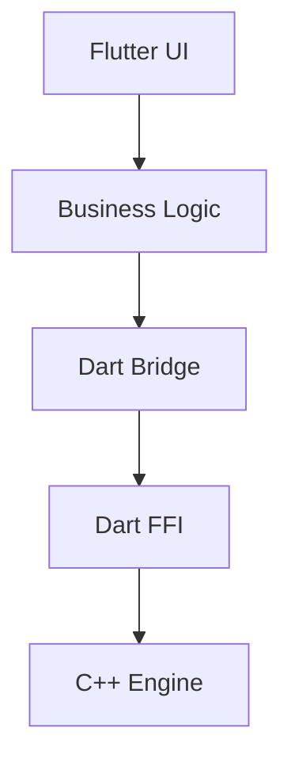

# Compiano Studio

**Compiano Studio** est une application d'apprentissage du piano assistée par IA, construite sur un moteur de rendu musical C++ haute performance intégré dans Flutter.

Plus qu'un simple lecteur, c'est une **Académie de Piano Virtuelle** qui combine la précision mathématique du C++ avec l'intelligence pédagogique de l'IA pour offrir un coaching de niveau conservatoire, basé sur les principes d'Alfred Cortot.

---

## ✨ Fonctionnalités & Modèle

### 🎹 Le Lecteur (Gratuit & Illimité)
Un outil professionnel pour travailler vos propres fichiers MusicXML.
- **Rendu Haute Fidélité** : Gravure SMuFL (Bravura) via moteur C++ natif (60fps).
- **Imports Illimités** : Support complet du format MusicXML (`.xml`, `.mxl`).
- **Outils de Travail** : Clavier virtuel, métronome visuel, feedback MIDI (Note jouée / attendue).
- **Personnalisation** : +50 options de gravure (taille, espacements, mode sombre).

### 🎓 L'Académie (Premium)
Un professeur particulier disponible 24/7 sur le répertoire certifié.
- **Catalogue Certifié** : Partitions validées avec doigtés d'experts (Cortot, Henle).
- **Analyse Cortot** : Diagnostic technique basé sur les *Principes Rationnels* (Passage du pouce, Extension, Polyphonie).
- **Coach IA** : Génération de routines de travail personnalisées et explications sémantiques des difficultés.
- **Sécurité** : L'IA n'intervient que sur des données fiables pour éviter les mauvais conseils techniques.

---

## 🧠 Philosophie Pédagogique : "Maths + IA"

Compiano Studio adopte une approche hybride unique :
1.  **La Vérité Terrain (C++)** : Le moteur calcule des métriques objectives (intervalles, densité, isochronie) sans hallucination.
2.  **L'Expertise (Cortot)** : Les difficultés sont classifiées selon les 5 piliers techniques du piano (Mobilité, Pouce, Polyphonie, Extension, Poignet).
3.  **Le Pédagogue (Gemini)** : L'IA traduit ces données en conseils humains et bienveillants.

---

## 🏗 Architecture Technique

L'application suit une **Layered Architecture** stricte pour isoler la complexité de la gestion mémoire native.



- **UI Layer** : Widgets Flutter réactifs (`ScorePainter`, `PianoKeyboard`).
- **Bridge Layer** : `lib/core/bridge.dart` gère le chargement des bibliothèques dynamiques (`.so`, `.dll`, `.dylib`) et le mapping des types C/Dart.
- **Native Layer** : `libmxmlconverter` (C++) effectue le calcul lourd (Layout, Engraving) et renvoie un buffer de commandes de dessin légères.

Voir ARCHITECTURE.md pour les détails complets.

---

## 🚀 Installation & Démarrage

### Pré-requis
- **Flutter SDK** (Stable channel)
- **CMake** & Compilateur C++ (GCC/Clang/MSVC) pour reconstruire la lib native si nécessaire.

### Configuration de la librairie native
Le projet dépend de `libmxmlconverter`. Assurez-vous que le binaire compilé est accessible :

- **Linux** : `libmxmlconverter.so` dans le dossier racine ou `LD_LIBRARY_PATH`.
- **Windows** : `mxmlconverter.dll` à côté de l'exécutable.
- **macOS** : `libmxmlconverter.dylib`.

### Lancer l'application
```bash
# Récupérer les dépendances
flutter pub get

# Lancer en mode debug (Desktop recommandé pour le dev)
flutter run -d linux  # ou windows, macos
```

---

## 📂 Structure du Projet

```text
lib/
├── core/           # Pont FFI et définitions bas niveau
├── logic/          # Logique métier (Controllers, Services)
├── ui/             # Widgets et Pages (ScorePainter, MainScreen)
└── main.dart       # Point d'entrée
native/             # Code source C++ (si inclus) ou scripts de build
assets/             # Polices (Bravura) et fichiers de démo
```

## 🗺 Roadmap

Le projet évolue rapidement. Consultez TODO.md pour voir les tâches en cours (Audio, Scroll Infini, IA) et FEATURES.md pour la liste exhaustive des fonctionnalités.